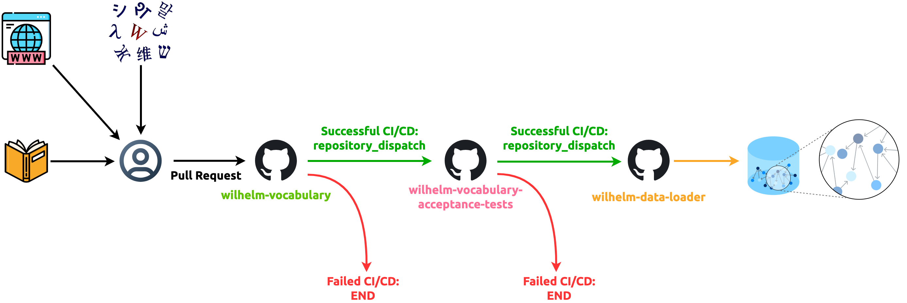

Wilhelm Vocabulary Acceptance Tests Framework
=============================================

[![Cucumber Badge][Cucumber Badge]][Cucumber]
[![GitHub workflow status badge][GitHub workflow status badge]][GitHub workflow status URL]
[![Apache License Badge]][Apache License, Version 2.0]

__wilhelm-vocabulary-acceptance-tests__ is a "gatekeeper" test framework between [wilhelm-vocabulary] and
[wilhelm-data-loader]. It runs [acceptance tests](https://cucumber.qubitpi.org/docs/bdd/) to make sure the data within
[wilhelm-vocabulary Hugging Face dataset] encode the expected knowledge graphs that are going to be displayed to user in
[wilhelmlang.com]

All acceptance tests are within the [*.feature](./features) files, which are the standard [Cucumber] test specs

Any commits to the `master` branch of [wilhelm-vocabulary] triggers
[acceptance tests CI/CD][GitHub workflow status URL]. If all acceptance tests pass, the project will tigger the
[data loader CI/CD](https://github.com/QubitPi/wilhelm-data-loader/actions/workflows/load-neo4j.yaml) to reload vocabularies

License
-------

The use and distribution terms for [wilhelm-vocabulary-acceptance-tests]() are covered by the [Apache License, Version 2.0].

[Apache License Badge]: https://img.shields.io/badge/Apache%202.0-F25910.svg?style=for-the-badge&logo=Apache&logoColor=white
[Apache License, Version 2.0]: https://www.apache.org/licenses/LICENSE-2.0

[Cucumber]: https://cucumber.qubitpi.org/
[Cucumber Badge]: https://img.shields.io/badge/Cucumber-23D96C.svg?style=for-the-badge&logo=cucumber&logoColor=white

[GitHub workflow status badge]: https://img.shields.io/github/actions/workflow/status/QubitPi/wilhelm-vocabulary-acceptance-tests/ci-cd.yaml?branch=master&style=for-the-badge&logo=github&logoColor=white&label=Acceptance%20Tests
[GitHub workflow status URL]: https://github.com/QubitPi/wilhelm-vocabulary-acceptance-tests/actions/workflows/ci-cd.yaml

[wilhelmlang.com]: https://wilhelmlang.com/
[wilhelm-vocabulary Hugging Face dataset]: https://huggingface.co/datasets/QubitPi/wilhelm-vocabulary
[wilhelm-vocabulary]: https://github.com/QubitPi/wilhelm-vocabulary
[wilhelm-data-loader]: https://github.com/QubitPi/wilhelm-data-loader
